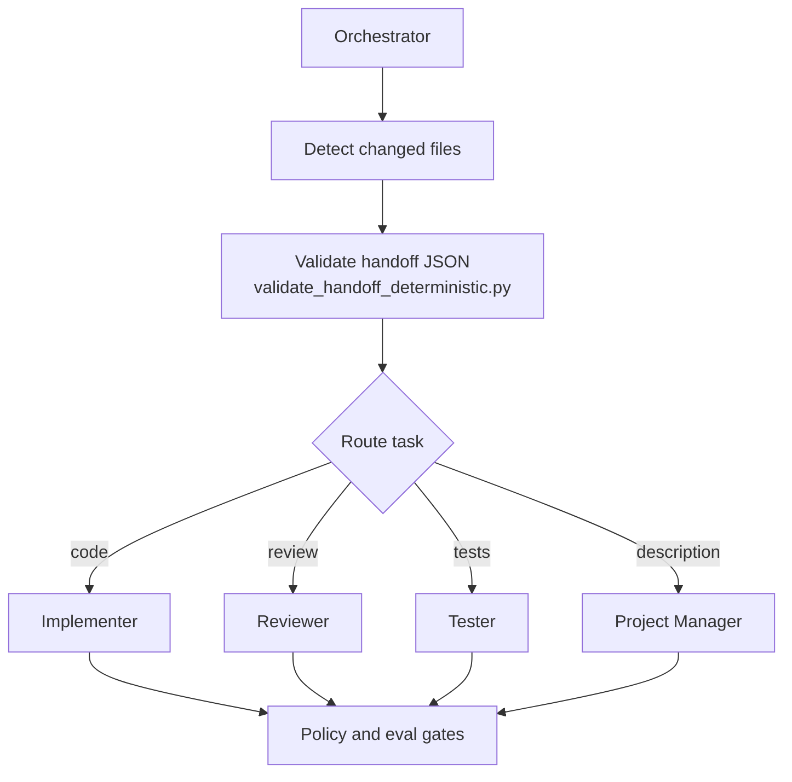

# Orchestration Diagram

```mermaid
flowchart TD
    A[Orchestrator] --> B[Detect changed files]
    B --> C[Validate handoff JSON\nvalidate_handoff_deterministic.py]
    C --> D{Route task}
    D -->|code| E[Implementer]
    D -->|review| F[Reviewer]
    D -->|tests| G[Tester]
    D -->|description| H[Project Manager]
    E --> I[Policy and eval gates]
    F --> I
    G --> I
    H --> I
```

The validator is deterministic and does not call a model. Agentic steps still run under the per-role governance policy.
